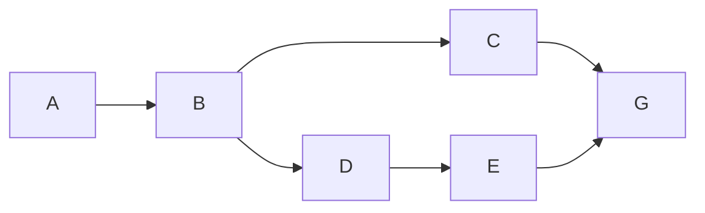

# Heading1

## Heading2

제목(Heading)은 `#`을 사용합니다.

## 인용구

인용구는 `>` 를 사용합니다.

> 인용구
> 
> 인간은 과거로부터 교훈을 얻고, 미래를 예측하며, 목표를 성취하기 위해 계획을 세운다. 
> <운동의 뇌과학>

## Callout

> [!Note] 주의하세요!
> Obsidian을 활용해서 자신만의 지식 세계를 구축해세요.
> 그럴수 있죠?
> 
> 어서요.
> 
> - 안녕하세요. 반갑습니다.
> 	- 이건 어쩔꺼영?
> - 이거지이거지

> [!Warning]
> Obsidian을 활용해서 자신만의 지식 세계를 구축해세요.
> 어서요.
> 
> - [ ] 이건가? 이것도 되려나
> 	- 이건 어쩔 꺼여? 

## List

- 리스트1
	- 리스트1.1
	- 리스트1.2
- 리스트2
	- 리스트2.1


## Number

1. Number
	1. Number
2. Number
	1. Number
	2. Number
3. Number33
	1. Number
		1. Numeber33

## Task

- [ ] 테스트다.
    - [ ] 이것도 이건?
- [ ] 이것도?
- [ ] 이건?
    - [ ] 이건?

## Code

### Code Block

```C
print("Helloworld!)
```

### Inline Code

C언어 출력 함수는 `printf()`입니다.


## Mermaid



## 더 많은 내용

- [Basic formatting syntax - Obsidian Help](https://help.obsidian.md/Editing+and+formatting/Basic+formatting+syntax)
- [Advanced formatting syntax - Obsidian Help](https://help.obsidian.md/Editing+and+formatting/Advanced+formatting+syntax)
- [Obsidian Flavored Markdown - Obsidian Help](https://help.obsidian.md/Editing+and+formatting/Obsidian+Flavored+Markdown)